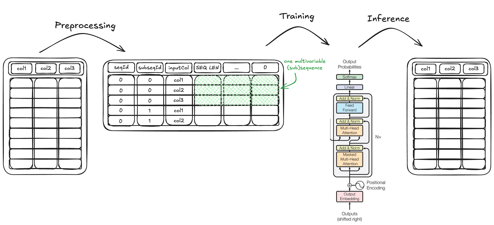

### What is sequifier?

Sequifier is the library that make prototyping autoregressive transformer models for sequence modelling easy, reliable and comparable.

The process looks like this:




### Motivation

The promise is that researchers, data scientists and ml scientists can take their sequential data sets, transform them into a standardized format, and from then use sequifier and configuration files to develop a model for these sequential data, apply it to a test set, and extrapolate these sequences through autoregression for an arbitrary number of steps. This should enable **much faster development and evaluation cycles**.

Importantly, sequifier works for an **arbitrary number of categorical and real valued input and output columns**, and can therefore represent a large set of possible mappings from inputs to outputs. The input and output columns do not have to be identical.

The standardized implementation of a decoder-only autorgressive transformer saves the work of implementing this model and the workflows around it repeatedly, across different domains and data sets, thereby **reducing duplicate work and the probability of bugs and compromised results**.

The standardized configuration enables easier experimentation and experiment tracking, and, if results are shared, an **ever-improving basis for decision making on the initial configuration** when applying the transformer architecture to a new problem.

Overall, it should be easy, **even for non-experts in machine learning**, to develop an initial prototype for a transformer model for a new domain. If the results are promising, it might become necessary to implement architecture variants that fall outside the scope of sequifier, but with a much cheaper (in terms of time and effort) initial exploration, many more potential application domains can be investigated.

### Data Formats

The basic data format that is used as input to the library takes the following form:

|sequenceId|itemPosition|column1|column2|...|
|----------|------------|-------|-------|---|
|0|0|"high"|12.3|...|
|0|1|"high"|10.2|...|
|...|...|...|...|...|
|1|0|"medium"|20.6|...|
|...|...|...|...|...|

The two columns "sequenceId" and "itemPositions" have to be present, and then there must be at least one feature column. There can also be many feature columns, and these can be categorical or real valued.

Data of this input format can be transformed into the format that is used for model training and inference, which takes this form:

|sequenceId|subsequenceId|columnName|[Subsequence Length]|[Subsequence Length - 1]|...|0|
|----------|-------------|----------|--------------------|------------------------|---|-|
|0|0|column1|"high"|"high"|...|"low"|
|0|0|column2|12.3|10.2|...|14.9|
|...|...|...|...|...|...|...|
|1|0|column1|"medium"|"high"|...|"medium"|
|1|0|column2|20.6|18.5|...|21.6|
|...|...|...|...|...|...|...|

On inference, the output is returned in the library input format, introduced first.

|sequenceId|itemPosition|column1|column2|...|
|----------|------------|-------|-------|---|
|0|963|"medium"|8.9|...|
|0|964|"low"|6.3|...|
|...|...|...|...|...|
|1|732|"medium"|14.4|...|
|...|...|...|...|...|


There are four standalone commands within sequifier: `make`, `preprocess`, `train` and `infer`. `make` sets up a new sequifier project in a new folder, `preprocess` preprocesses the data from the input format into subsequences of a fixed length, `train` trains a model on the preprocessed data, and `infer` generates outputs from data in the preprocessed format and outputs it in the initial input format.


## Other materials
To get more details on the specific configuration options, go to these [explanations of config parameters.](config-parameters.md)

If you want to first get a more specific understanding of the transformer architecture, have a look at
the [Wikipedia article.](https://en.wikipedia.org/wiki/Transformer_(machine_learning_model))

If you want to see a benchmark on a small synthetic dataset with 10k cases, agains a random forest,
an xgboost model and a logistic regression, check out [this notebook.](./documentation/demos/benchmark-small-data.ipynb)


## Complete example how to build and apply a transformer sequence classifier with sequifier

1. create a conda environment with python >=3.9 activate and run
```console
pip install sequifier
```
2. To create the project folder with the config templates in the configs subfolder, run
```console
sequifier make YOUR_PROJECT_NAME
```
3. cd into the `YOUR_PROJECT_NAME` folder, create a `data` folder and add your data and adapt the config file `preprocess.yaml` in the configs folder to take the path to the data
4. run
```console
sequifier preprocess
```
5. the preprocessing step outputs a "data driven config" at `configs/ddconfigs/[FILE NAME]`. It contains the number of classes found in the data, a map of classes to indices and the oaths to train, validation and test splits of data. Adapt the `dd_config` parameter in `train.yaml` and `infer.yaml` in to the path `configs/ddconfigs/[FILE NAME]`
6. Adapt the config file `train.yaml` to specify the transformer hyperparameters you want and run
```console
sequifier train
```
7. adapt `data_path` in `infer.yaml` to one of the files output in the preprocessing step
8. run
```console
sequifier infer
```
9. find your predictions at `[PROJECT PATH]/outputs/predictions/sequifier-default-best-predictions.csv`


### More detailed explanations of the three steps
#### Preprocessing of data into sequences for training

```console
sequifier preprocess --config_path=[CONFIG PATH]
```

The config path specifies the path to the preprocessing config and the project
path the path to the (preferably empty) folder the output files of the different
steps are written to.

The default config can be found on this path:

[configs/preprocess.yaml](./configs/preprocess.yaml)


#### Configuring and training the sequence classification model

The training step is executed with the command:

```console
sequifier train --config_path=[CONFIG PATH]
```

If the data on which the model is trained DOES NOT come from the preprocessing step, the flag

```console
--on-unprocessed
```

should be added.

If the training data does not come from the preprocessing step, both train and validation
data have to take the form of a csv file with the columns "sequenceId", "subsequenceId", "inputCol", [SEQ LENGTH], [SEQ LENGTH - 1],...,"1", "0".
You can find an example of the preprocessing input data at [documentation/example_inputs/training_input.csv](./documentation/example_inputs/training_input.csv)

The training step is configured using the config. The two default configs can be found here:

[configs/train.yaml](./configs/train.yaml)

depending on whether the preprocessing step was executed.


#### Inferring on test data using the trained model

Inference is done using the command:

```console
sequifier infer --config_path=[CONFIG PATH]
```

and configured using a config file. The default version can be found here:

[configs/infer.yaml](./configs/infer.yaml)
