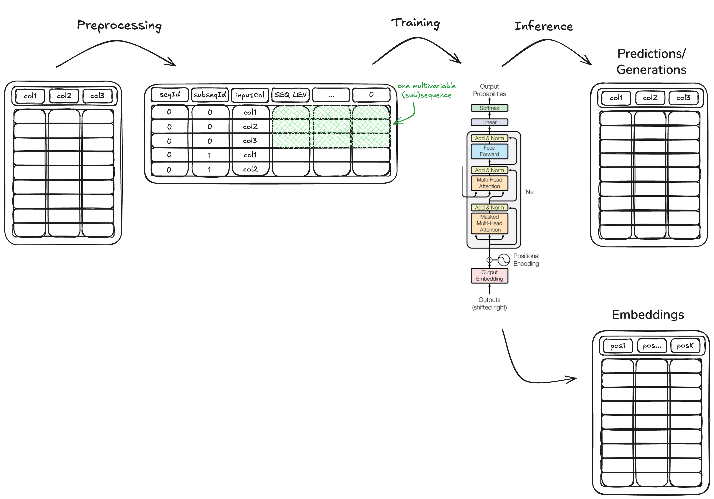

## What is sequifier?

Sequifier makes training and inference of powerful transformer sequence models fast and trustworthy.

The process looks like this:




### Value Proposition

Implementing a model from scratch takes time, and there are a surprising number of aspects to consider. The idea is: why not do it once, make it configurable, and then use the same implementation across domains and datasets.

This gives us a number of benefits:

- rapid prototyping
- configurable architecture
- trusted implementation (you can't create bugs inadvertedly)
- standardized logging
- native multi-gpu support (DDP and FSDP)
- native multi-core preprocessing
- scales to datasets larger than RAM
- hyperparameter optimization using Optuna (Bayesian, Random, or Grid search)
- can be used for prediction, generation and embedding on/of arbitrary sequences

The only requirement is having sequifier installed, and having input data in the right format.


### The Six Commands

There are six standalone commands within sequifier: `make`, `preprocess`, `train`, `infer`, `hyperparameter-search`, and `visualize-training`.

`make` sets up a new sequifier project in a new folder, `preprocess` preprocesses the data from the input format into subsequences of a fixed length, `train` trains a model on the preprocessed data, `infer` generates predictions, probabilities, or embeddings from data in the preprocessed format, `hyperparameter-search` executes multiple training runs using Optuna to find optimal configurations, and `visualize-training` reads structured training metrics to generate interactive HTML plots of your loss curves.

There are documentation pages for each command, except make:

 - [preprocess documentation](./documentation/configs/preprocess.md)
 - [train documentation](./documentation/configs/train.md)
 - [infer documentation](./documentation/configs/infer.md)
 - [hyperparameter-search documentation](./documentation/configs/hyperparameter-search.md)
 - [visualize-training documentation](./documentation/commands/visualize-training.md)


### Other Materials

To get the full auto-generated documentation, visit [sequifier.com](https://sequifier.com)

If you want to first get a more specific understanding of the transformer architecture, have a look at
the [Wikipedia article.](https://en.wikipedia.org/wiki/Transformer_(machine_learning_model))

If you want to see an end-to-end example on very simple synthetic data, check out this [this notebook.](./documentation/demos/self-contained-example.ipynb)


## Structure of a Sequifier Project

Sequifier is designed with a specific folder structure in mind:

```text
YOUR_PROJECT_NAME/
├── configs/
│   ├── preprocess.yaml
│   ├── train.yaml
│   └── infer.yaml
├── data/
│   └── (Place your CSV/Parquet files here)
├── outputs/
│   ├── embeddings(?)
│   ├── predictions(?)
│   ├── probabilities(?)
│   └── visualization/
└── logs/

```

The `sequifier` commands should typically be run in the project root.

Within YOUR_PROJECT_NAME, you can also add other folders for additional steps, such as `notebooks` or `scripts` for pre- or postprocessing, and `analysis`, `visualizations` or `evals` for files you generate in other, manual steps.

### Data Transformations in Sequifier

Let's start with the data format expected by sequifier. The basic data format that is used as input to the library takes the following form:

|sequenceId|itemPosition|column1|column2|...|
|----------|------------|-------|-------|---|
|0|0|"high"|12.3|...|
|0|1|"high"|10.2|...|
|...|...|...|...|...|
|1|0|"medium"|20.6|...|
|...|...|...|...|...|

The two columns "sequenceId" and "itemPosition" have to be present, and then there must be at least one feature column. There can also be many feature columns, and these can be categorical or real valued.

Data of this input format can be transformed into the format that is used for model training and inference using `sequifier preprocess`. Preprocessing defines the physical `window_length` and `max_target_offset`; training and inference choose the model-facing `context_length` from that stored capacity:

|sequenceId|subsequenceId|startItemPosition|leftPadLength|inputCol|[Window Length - 1]|[Window Length - 2]|...|0|
|----------|-------------|-----------------|-------------|--------|-------------------|-------------------| - |-|
|0|0|0|0|column1|"high"|"high"|...|"low"|
|0|0|0|0|column2|12.3|10.2|...|14.9|
|...|...|...|...|...|...|...|...|...|
|1|0|15|0|column1|"medium"|"high"|...|"medium"|
|1|0|15|0|column2|20.6|18.5|...|21.6|
|...|...|...|...|...|...|...|...|...|

On inference, the output is returned in the library input format, introduced first.

|sequenceId|itemPosition|column1|column2|...|
|----------|------------|-------|-------|---|
|0|963|"medium"|8.9|...|
|0|964|"low"|6.3|...|
|...|...|...|...|...|
|1|732|"medium"|14.4|...|
|...|...|...|...|...|


### Complete Example of Training and Inferring a Transformer Model

Once you have your data in the input format described above, you can train a transformer model in a couple of steps on them.

1.  create a conda environment with python \>=3.10 and \<=3.13 activate and run

```console
pip install sequifier
```

2.  To create the project folder with the config templates in the configs subfolder, run

```console
sequifier make YOUR_PROJECT_NAME
```

3.  cd into the `YOUR_PROJECT_NAME` folder, create a `data` folder and add your data and adapt `preprocessing_data_path` in `preprocess.yaml` to point to the data
4.  run

```console
sequifier preprocess
```

5.  the preprocessing step outputs metadata at `configs/metadata_configs/[FILE NAME]`. For a single dataset and part, reference that file from `dataset.part.metadata_config_path` in `train.yaml`; named configurations use `dataset_training.<dataset>.parts.<part>.metadata_config_path`. Inference may still use `preprocessing_data_path` or `metadata_config_path`
6.  Adapt the config file `train.yaml` to specify the transformer hyperparameters you want and run


```console
sequifier train
```

7.  point `model_path` in `infer.yaml` at the default ONNX export. Keep the
    scaffold's explicit contract, or replace it with `training_config_path` and
    `dataset`; see the [ONNX/PT trade-offs](./documentation/configs/infer.md#onnx-or-pt)
8.  run


```console
sequifier infer
```

9.  find your predictions at `[PROJECT ROOT]/outputs/predictions/[EXPORTED_MODEL_BASENAME]-predictions.[FORMAT]`, for example `outputs/predictions/your-model-best-predictions.csv`


## Other Features

### Embedding Model

While Sequifier's primary use case is training predictive or generative causal transformer models, it also supports the export of embedding models.

Configuration:

- Training: Set export_embedding_model: true in the training config.
- Activation sources: Set `embedding_layer_names` to an ordered list such as
  `[backbone.layers.1, decoder.branches.default.hidden_blocks.0]`.
- Inference: Set model_type: embedding in the inference config.

Technical Details: Selected activations are restricted to the configured final
`prediction_length` positions and concatenated in configuration order along the
feature dimension. Backbone selectors contribute `dim_model` values. Decoder MLP
hidden-block selectors contribute their configured hidden width and receive the
same flattened `decoding_support * dim_model` windows used during training. The
default, `embedding_layer_names: [backbone.final_norm]`, preserves the final
normalized backbone representation. Because a causal model is trained to predict
future state, its embedding is forward-looking.

### Distributed Training

Sequifier supports distributed training using torch `DistributedDataParallel` and `FullyShardedDataParallel`. To make use of multi gpu support, the preprocessing step must write sharded output with `merge_output: false`. `write_format: pt` is the recommended production format; sharded `parquet` is also supported but currently considered beta for distributed training.

For the full guide on how to configure a distributed run, check the [multi-GPU training guide](./documentation/training/multi-gpu-training.md).

### System Requirements

Tiny transformer models on little data can be trained on CPU. Bigger ones require an Nvidia GPU with a compatible cuda version installed.

Sequifier currently runs on MacOS and Ubuntu.

## Citation

Please cite with:

```bibtex
@software{sequifier_2025,
  author = {Luithlen, Leon},
  title = {sequifier - causal transformer models for multivariate sequence modelling},
  year = {2025},
  publisher = {GitHub},
  version = {v2.0.0.0},
  url = {[https://github.com/0xideas/sequifier](https://github.com/0xideas/sequifier)}
}

```
